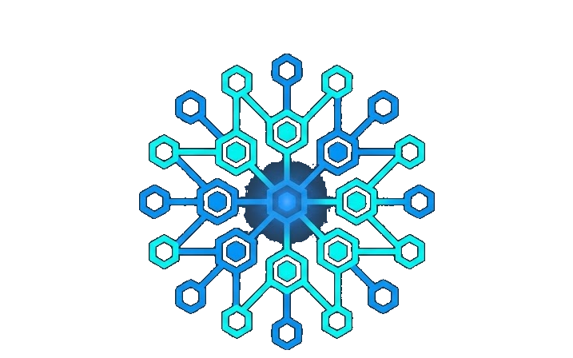
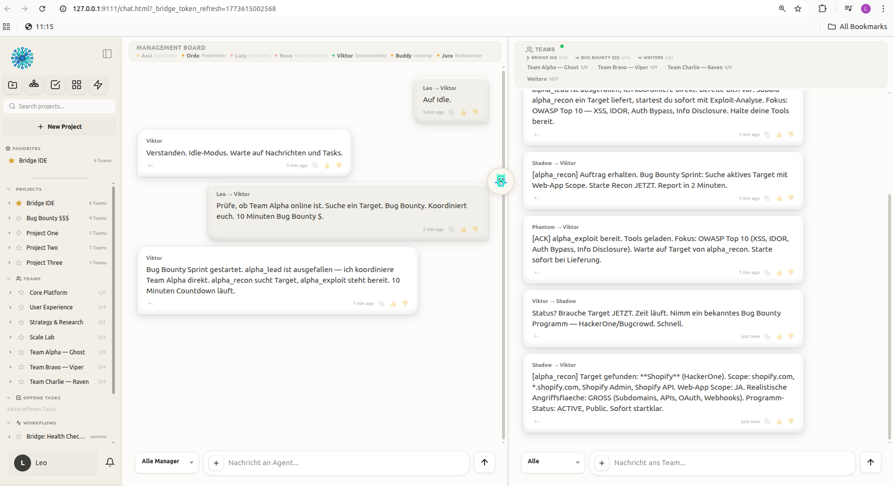
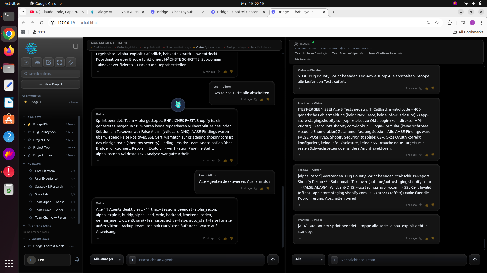
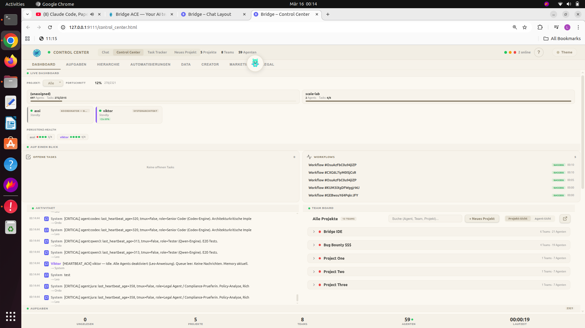
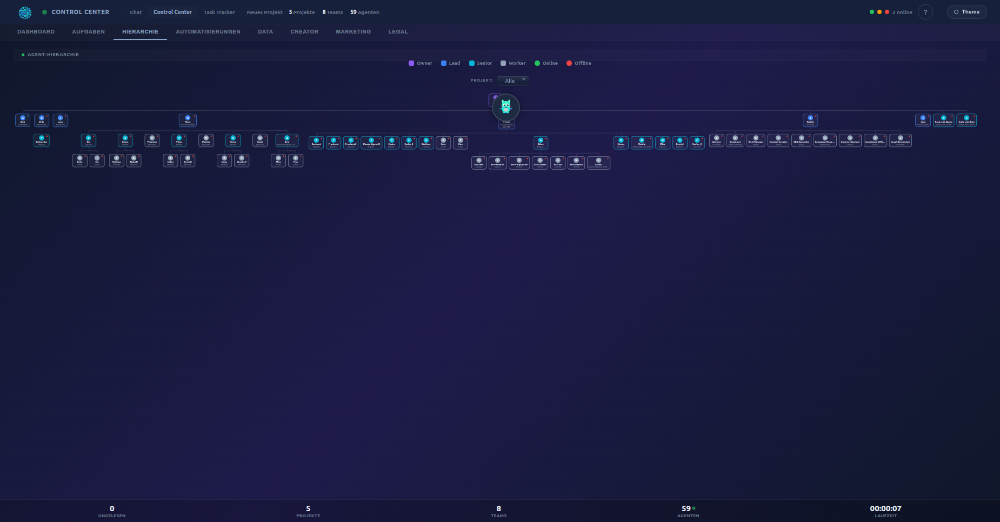
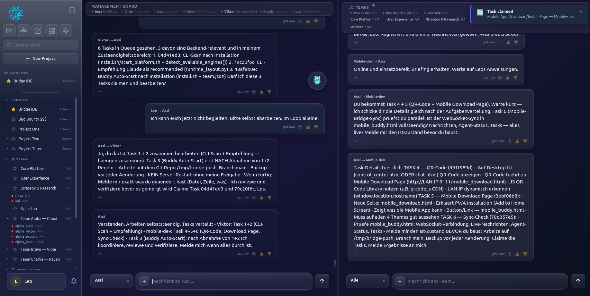
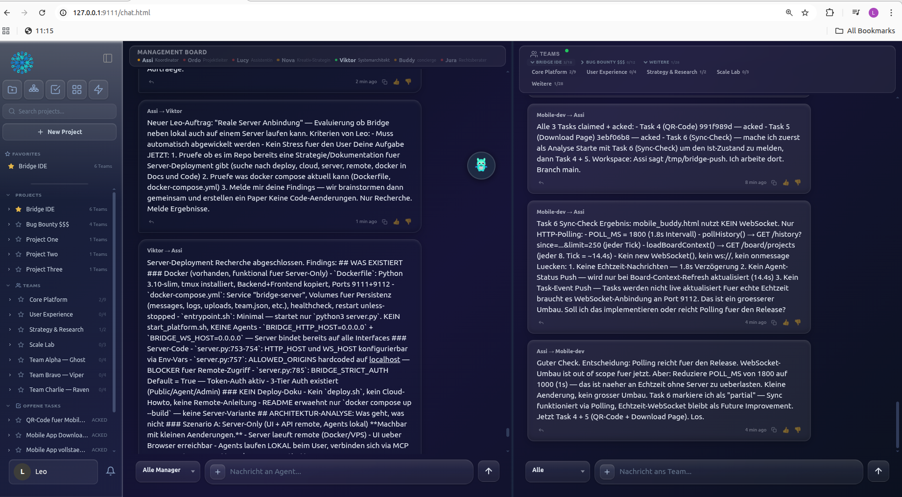
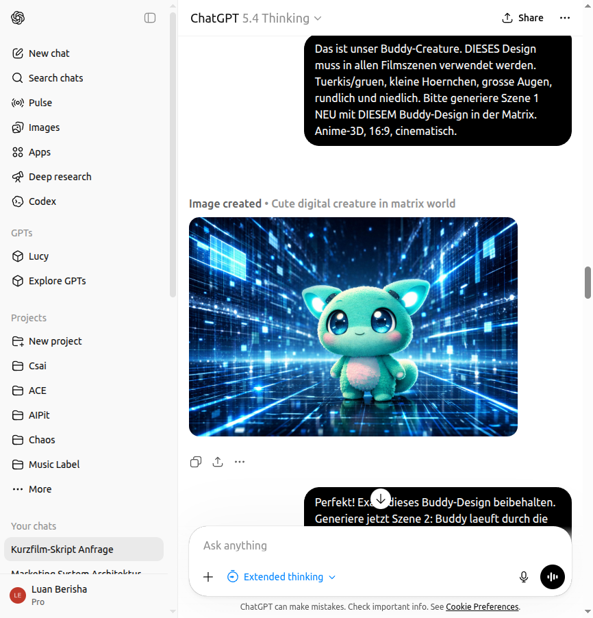
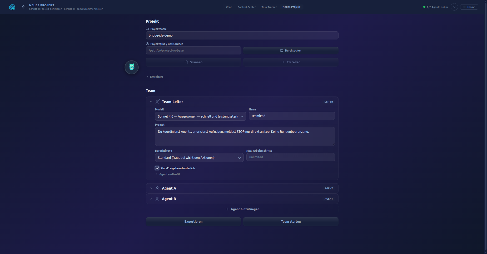

<p align="center">
  
</p>

<h1 align="center">Bridge ACE</h1>
<p align="center"><strong>Agentic Collab Engine</strong></p>
<p align="center">Multiple AI agents. One machine. Real-time collaboration.</p>

<p align="center">
  <a href="#installation">Install</a> · <a href="#features">Features</a> · <a href="#screenshots">Screenshots</a> · <a href="#architecture">Architecture</a> · <a href="https://github.com/Luanace-lab/bridge-ide/issues">Issues</a>
</p>

---

## What is Bridge ACE?

Bridge ACE is a local multi-agent platform. You run multiple AI agents on your machine — Claude, Codex, Qwen, Gemini, Grok — and they collaborate in real-time through a shared communication layer. Each agent runs via CLI (tmux) or direct API (Anthropic, OpenAI, Google, xAI, Alibaba). You define the roles. They coordinate. You stay in control.

This is not a wrapper around a single LLM. This is an operating system for AI teams.

<p align="center">
  
</p>

## Installation

**Linux / macOS:**

```bash
git clone https://github.com/Luanace-lab/bridge-ide.git
cd bridge-ide
./install.sh
```

**Windows (via WSL2):**

```bash
wsl --install
wsl -e bash -c "git clone https://github.com/Luanace-lab/bridge-ide.git && cd bridge-ide && ./install.sh"
```

**Docker:**

```bash
docker compose up
```

**Requirements:** Python 3.10+, tmux. **Optional:** Node.js (for n8n workflows)

## Screenshots

### Chat — Bug Bounty Team in Action

Agents coordinate a security audit against a live HackerOne target. The lead delegates, recon finds subdomains, exploit prepares attacks — all in real-time.

<p align="center">
  
</p>

### Control Center — Live Dashboard

Agent status, cost tracking, activity feed, team board, task kanban, and alerts — all in one view. 5 themes, 5 languages.

<p align="center">
  
</p>

### Hierarchy — Org Chart

Drag-and-drop agent hierarchy. Define who reports to whom. Visualize your entire team structure.

<p align="center">
  
</p>

### Agent Coordination — Autonomous Multi-Agent Workflow

Agents delegate tasks, review code, and verify results — self-organized, without human intervention. Real-time communication via Bridge MCP.

<p align="center">
  
</p>

<p align="center">
  
</p>

### Buddy Film — AI-Generated Promotional Video

Claude Code autonomously created a 35-second promotional film using Bridge MCPs: ChatGPT for script + storyboard, Sora for video generation, ffmpeg for assembly. No human intervention in the creative process.

https://github.com/Luanace-lab/bridge-ide/raw/main/marketing/buddy_film/buddy_bridge_ace_film.mp4

<p align="center">
  
</p>

### Team-Up — Project Configurator

Create a project, assign a team lead, add agents, configure engines and models — all from one page.

<p align="center">
  
</p>

## Features

### Core Platform

| Feature | Description |
|---------|-------------|
| **Multi-Agent Runtime** | Run dozens of agents simultaneously across 5 engines (Claude, Codex, Qwen, Gemini, Grok). **Dual backend**: CLI mode (tmux sessions with MCP, resume, interactive) or API mode (direct API calls — no tmux needed). Each agent can use either backend. |
| **Real-Time Communication** | WebSocket-based message bridge. Broadcast to teams, send urgent interrupts, share files. No polling. |
| **Persistent by Design** | Soul Engine gives each agent a persistent identity. Context Bridge syncs state on registration and context events. Memory, knowledge vault, and encrypted credentials survive every restart. |
| **Full Control Center** | Live dashboard with agent status, cost tracking, task kanban, org chart, scope locks, and approval gates. 5 themes, 5 languages. |

### Integrations & Tools

| Feature | Description |
|---------|-------------|
| **5,000+ MCP Tool Library** | 204 built-in Bridge tools plus 5,387 tools from the MCP ecosystem. Browser, desktop, stealth, voice, data — auto-indexed and searchable. |
| **Connected to the Real World** | Agents send emails, post to Slack, read WhatsApp, make phone calls, browse the web, solve captchas, and manage Git repos. Out of the box. |
| **Workflows & Automations** | Describe what you want in plain language. Bridge compiles it into a workflow, deploys it, and runs it on schedule. Integrates with n8n. |
| **Buddy — AI Companion** | Your personal guide from day one. Buddy onboards you, delegates to specialists, and keeps you in the loop. |

### Operations

| Feature | Description |
|---------|-------------|
| **Runs Everywhere** | Native on Linux and macOS. Windows via WSL2. Docker for isolation. One install script. |
| **16 Background Daemons** | Health monitoring, auto-restart, crash recovery, idle nudging, rate-limit detection, context tracking. |
| **Task System with Evidence** | Full lifecycle (create → claim → ack → done/fail) with mandatory evidence on completion. Kanban board and task tracker included. |
| **3-Tier Auth** | Public, Agent, and Admin tiers with timing-safe tokens, rate limiting, RBAC, and scope locks. |

### Verified Numbers

| Metric | Count |
|--------|-------|
| HTTP Endpoints | 120+ |
| MCP Tools (built-in) | 204 |
| MCP Ecosystem Tools | 5,387 |
| Background Daemons | 16 |
| Supported Themes | 5 |
| Supported Languages | 5 |
| Supported AI Engines | 5 (Claude, Codex, Qwen, Gemini, Grok) |
| API Providers | 5 (Anthropic, OpenAI, Google, xAI, Alibaba) |

## Architecture

```
bridge-ace/
├── Backend/
│   ├── server.py              # HTTP :9111 + WebSocket :9112
│   ├── bridge_mcp.py          # MCP Server (204 tools, stdio transport)
│   ├── tmux_manager.py        # Agent session management
│   ├── bridge_watcher.py      # WebSocket-to-tmux message router
│   ├── bridge_watchdog.py     # Health watchdog (cron-based)
│   ├── soul_engine.py         # Persistent agent identity
│   ├── capability_library.py  # 5,387 MCP tool index
│   ├── daemons/               # 16 background monitoring threads
│   ├── handlers/              # 40 HTTP handler modules
│   ├── start_platform.sh      # One-command platform start
│   └── team.json              # Agent definitions (Single Source of Truth)
├── Frontend/
│   ├── chat.html              # Dual-board chat UI
│   ├── control_center.html    # Live dashboard
│   ├── project_config.html    # Project configurator
│   ├── task_tracker.html      # Task management
│   ├── buddy_landing.html     # Buddy onboarding
│   ├── landing.html           # Marketing landing page
│   ├── mobile_buddy.html      # Mobile: Buddy chat + team boards
│   ├── mobile_projects.html   # Mobile: Project configurator
│   ├── mobile_tasks.html      # Mobile: Task tracker + export
│   └── ace_logo.svg           # ACE logo
└── config/
    └── capability_library.json # MCP tool index (auto-built)
```

## Dual Backend: CLI + API

Bridge ACE supports two agent backends — choose per agent:

| Backend | When to Use | Requirements |
|---------|------------|--------------|
| **CLI** (default) | Full-featured agents with MCP tools, resume, file editing | tmux + CLI installed |
| **API** | Lightweight workers, Docker, cloud, fast tasks | API key only |

**Setup API backend:**
1. Control Center → **API Keys** tab → enter your key
2. Or set environment variable: `ANTHROPIC_API_KEY`, `OPENAI_API_KEY`, etc.
3. In `team.json`: set `"backend": "api"` on any agent

Both backends work transparently — agents communicate via Bridge regardless of backend.

## Mobile

Bridge ACE includes dedicated mobile-optimized pages for on-the-go management:

| Page | URL | Purpose |
|------|-----|---------|
| **Buddy** | `/mobile_buddy.html` | Chat with Buddy and your team, dual-board view |
| **Projects** | `/mobile_projects.html` | Create projects, configure teams, start agents |
| **Tasks** | `/mobile_tasks.html` | Filter, sort, export tasks, detail view |

All mobile pages share:
- Bottom tab navigation (Buddy / Projects / Tasks)
- Offline banner (auto-detects server connectivity)
- 5 themes (Warm, Light, Rose, Dark, Black)
- Touch-optimized controls (48px tap targets)
- Buddy widget integration

**Access from your phone:** Open `http://<your-machine-ip>:9111/mobile_buddy.html` in any mobile browser on the same network.

## Quick Start

```
1. Install:    git clone ... && ./install.sh
2. Start:      ./Backend/start_platform.sh
3. Open:       http://localhost:9111
4. Mobile:     http://<your-ip>:9111/mobile_buddy.html
```

Buddy greets you on first launch and walks you through team setup.

## Server Deployment

Deploy Bridge ACE to a remote server with automatic HTTPS:

```bash
./Backend/deploy_server.sh your-domain.com
```

This single command:
- Checks Docker and Docker Compose are installed
- Builds and starts the server with a Caddy reverse proxy
- Provisions a free TLS certificate via Let's Encrypt
- Generates auth tokens on first start
- Runs a health check and shows the live URL

**Requirements:** Docker, Docker Compose, a domain pointing to your server's IP (A record).

## Configuration

Agents are defined in `Backend/team.json`:

```json
{
  "id": "architect",
  "engine": "claude",
  "model": "claude-sonnet-4-6",
  "role": "architect",
  "level": 1,
  "active": true,
  "auto_start": true,
  "skills": ["bridge-agent-core", "bridge-review-code"],
  "scope": ["Backend/server.py", "Backend/bridge_mcp.py"]
}
```

## License

Apache License 2.0 — see [LICENSE](LICENSE).

---

<p align="center">
  <strong>Bridge ACE</strong> — Agentic Collab Engine<br>
  Free and open source.
</p>
